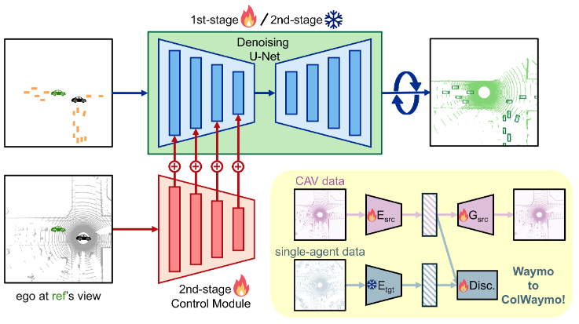

I am a second year M.S. in Computer Science and Engineering student
at [The Ohio State University](https://cse.osu.edu/),
advised by Prof. [Wei-Lun (Harry) Chao](https://sites.google.com/view/wei-lun-harry-chao). I am broadly interested in
Computer Vision
and Machine Learning, and their application to autonomous driving.

Previously, I received my B.S. degree from [The Ohio State University](https://cse.osu.edu/).

## Research

<table style="border: none; border-collapse: collapse;" border="0">

<tr style="border-collapse: separate; border-spacing:30em;">
<td style="border-collapse: collapse; border: none;">
 </td>

<td style="border-collapse: collapse; border: none;">
<b>Transfer Your Perspective: Controllable 3D Generation from Any Viewpoint in a Driving Scene</b>
 
<b>Zanming Huang</b>*, Zhongkai Shangguan*, Jimuyang Zhang, Gilad Bar, Matthew Boyd, Eshed Ohn-Bar 

<i>European Conference on Computer Vision (ECCV)</i>, 2022
 
<a href="https://eshed1.github.io/papers/assister_eccv2022.pdf">[Paper]</a> |
<a href="https://github.com/h2xlab/ASSISTER">[Github]</a>
</td>
</tr>  

</table>