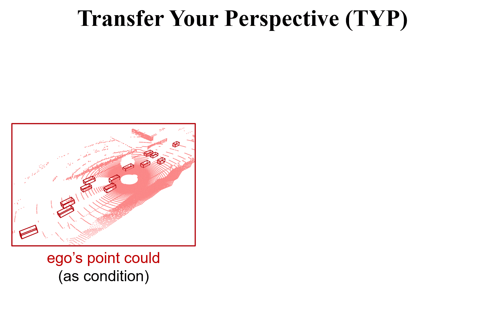
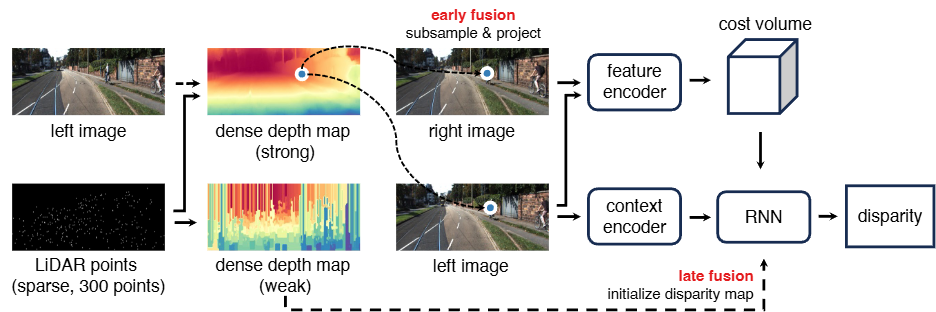
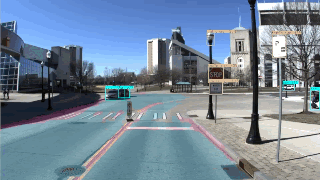

My name is Sooyoung Jeon and I am a second year M.S. in Computer Science and Engineering student
at [The Ohio State University](https://cse.osu.edu/),
advised by Prof. [Wei-Lun (Harry) Chao](https://sites.google.com/view/wei-lun-harry-chao). I am broadly interested in
Computer Vision
and Machine Learning, and their application to autonomous driving.

Previously, I received my B.S. degree from [The Ohio State University](https://cse.osu.edu/).

## Research

<table style="border: none; border-collapse: collapse;" border="0">

<tr style="border-collapse: separate; border-spacing:30em;">
<td style="border-collapse: collapse; border: none;">
 </td>

<td style="border-collapse: collapse; border: none;">
<b>Transfer Your Perspective: Controllable 3D Generation from Any Viewpoint in a Driving Scene</b>
 
Tai-Yu Pan, <b>Sooyoung Jeon</b>, Mengdi Fan, Jinsu Yoo, Zhenyang Feng, Mark Campbell, Kilian Q Weinberger, Bharath Hariharan, Wei-Lun Chao
 
<i>CVPR 2025</i>
 
<a href="https://arxiv.org/pdf/2502.06682">[paper]</a>
<a href="https://arxiv.org/abs/2502.06682">[arXiv]</a>
</td>
</tr>

<!--<tr style="border-collapse: separate; border-spacing:30em;">
<td style="border-collapse: collapse; border: none;">
 </td>

<td style="border-collapse: collapse; border: none;">
<b>An Exploratory Journey in Extremely Sparse LiDAR-Guided Stereo Through the Lens of Depth Pre-Fill</b>
 
Jinsu Yoo, <b>Sooyoung Jeon</b>, Tai-Yu Pan, Wei-Lun Chao

 
<i>pre-print</i>
 
<a href="https://drive.google.com/file/d/1SlxeasPD5fA8YPqFVCFC017B3W8UuUuL/view?usp=drive_link">[paper]</a>
</td>
</tr>-->  

</table>

## Project
<table style="border: none; border-collapse: collapse;" border="0">

<tr style="border-collapse: separate; border-spacing:30em;">
<td style="border-collapse: collapse; border: none;">
 </td>

<td style="border-collapse: collapse; border: none;">
<b>Perception System in SAE AutoDrive Competition II - Year 4</b>
 
<b>Sooyoung Jeon</b>, Buckeye Autodrive

 
<i>As a Perception Team Lead</i>
 
<a href="https://sites.google.com/view/buckeyeautodrive/home">[team site]</a>
<a href="https://www.sae.org/attend/student-events/autodrive-challenge-series2">[SAE]</a>
</td>
</tr>

</table>
